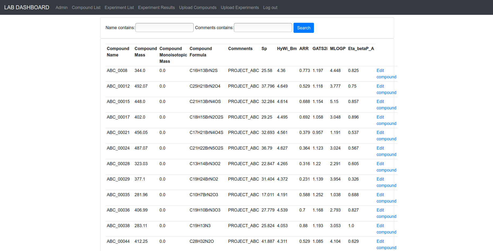
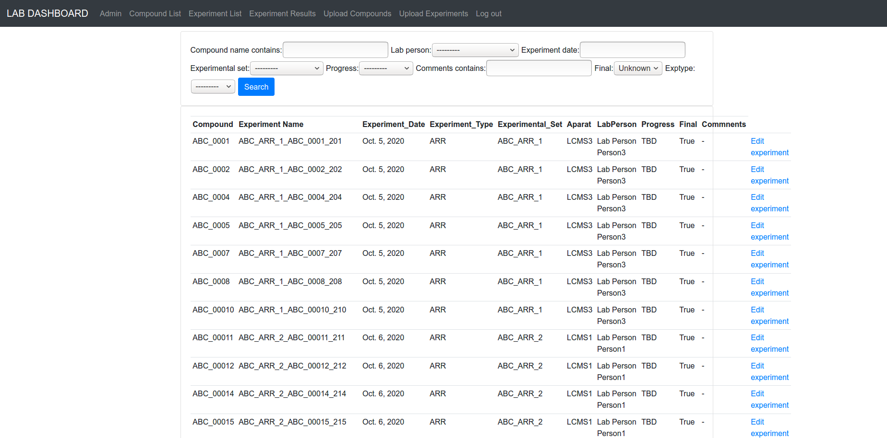
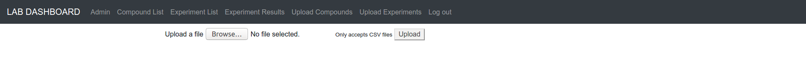
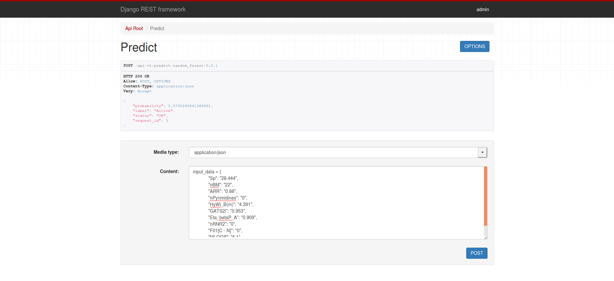

# Experiments app

## Summary:
Application dedicated to store and retrieve information about experiments in
the chemical laboratory. The application can display data as html templates and
also REST API is provided (API documentation is provided by the use of 
Swagger - http://127.0.0.1:8000/docs/). The part of API is dedicated to 
predict activity of chemical compound based on the freeware dataset using
machine learning algorithm. During development step real data from a laboratory
were replaced by chemical descriptors taken from dataset used for ML predictor. 
The basic authentication for html templates and API is implemented.

## Features:
 - Storing information about compounds:
    - name
    - project
    - molecular mass
    - monoisotopic mass
    - empirical parameters which describe properties of chemical compound (in development stage replaced by molecular descriptors)
     

  - Storing experimental results from different experiment types:
    - chemical compound used in particular measurement
    - date of the experiment
    - experiment type
    - performer
    - used equipment (aparat)
    - experimental set
    - progress
    - experimental data
      

  - Uploading data in csv form:
    - information about compounds
    - planned experiments
    - results of the experiments
      

  - Predicting compound properties based on experimental data (in development 
    stage based on molecular descriptors) using machine learning algorithms.

    
## Technologies/libraries
* Python
* Django and Django REST framework
* Django-filter
* Scikit-learn
* Pandas
* Bootstrap (front-end framework)
* Swagger

# Acknowledgements
Freeware dataset containing molecular descriptors used for development of
this application came form scientific publication:
Nembri, S.; Grisoni, F.; Consonni, V.; Todeschini, R. In Silico Prediction of Cytochrome P450-Drug Interaction: QSARs for CYP3A4 and CYP2C9. Int. J. Mol. Sci. 2016, 17, 914.